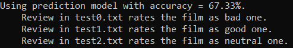

# Reviews sentiment analysis

#### Structure:
1. data:
    - origin - original data in three folders (bad, good, neutral reviews)
    - kinopoisk3000.csv - aggregated dataset
    - prepared_kinopoisk3000.csv - prepared data
2. src:
    - models_train.py - contains function to train given models and choose the best one from them
    - preprocessing.py - contains functions to preprocess data for futher train and prediction
3. test:
    - test.py - load data, preprocess it, train models, make predictions
    - test*.txt - reviews to test model
    - result.png - results of test

#### Usage:
All required packages listed in "requirements.txt". Example usage is shown in "tests/test.py".

#### Results:
This example shows situation, where predictor classify third review as "neutral" one, but its original label is "bad". However, the review #3 is actually quite neutral, so the predictor seems accurate to me.

#### Credits:
Thanks to https://habr.com/ru/post/467081/ for original data.